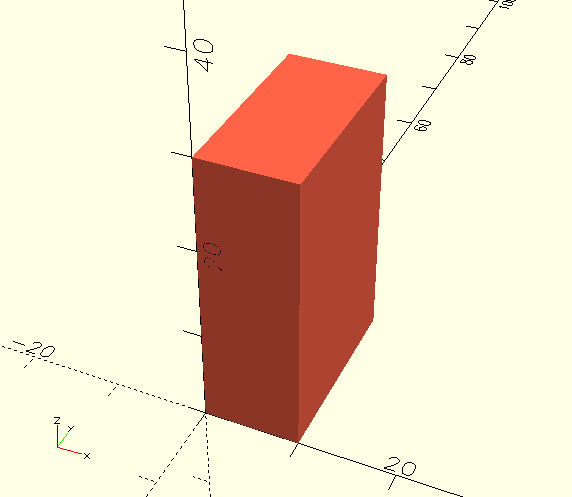

<h1 align="center"> <a href="https://pythonscad.org"
  target="_blank"></a> <br> PythonSCAD <br> </h1>
  <h3 align="center">Script-based 3D modeling app which lets you use
  Python as its native language</h3>

<p align="center"> <a href="https://groups.google.com/g/pythonscad"
target="_blank"> 
</a><a href="https://www.reddit.com/r/OpenPythonSCAD/"
target="_blank"> 
</a><a href="https://pythonscad.org" target="_blank"> 
</a> <a href="https://deepwiki.com/pythonscad/pythonscad"></a>
</p>


PythonSCAD is a programmatic 3D modeling application. It allows you to
turn simple code into 3D models suitable for 3D printing.

It is a fork of [OpenSCAD](https://openscad.org) which not only adds
support for using Python as a native language, but also adds new
features and improves existing ones.

- [When to not use PythonSCAD](#when-to-not-use-pythonscad)
- [Difference to OpenSCAD](#difference-to-openscad)
  - [Intentional language limitations of OpenSCAD](#intentional-language-limitations-of-openscad)
  - [Solids as 1st class objects](#solids-as-1st-class-objects)
  - [Additional methods in PythonSCAD](#additional-methods-in-pythonscad)
  - [Python](#python)
  - [PythonSCAD -\> functional language, OpenSCAD -\> descriptive Language](#pythonscad---functional-language-openscad---descriptive-language)
- [Installing](#installing)
- [Example code](#example-code)
- [Documentation](#documentation)
- [Building PythonSCAD from source](#building-pythonscad-from-source)
    - [Prerequisites](#prerequisites)
    - [Getting the source code](#getting-the-source-code)


# When to not use PythonSCAD

If you need to create complex organic shapes, animate models, or
produce visual effects, PythonSCAD is not the ideal choice. You will
probably be much happier using [Blender](https://www.blender.org/) or
similar tools, especially for creative, visual, and animation tasks.

PythonSCAD is optimized for script-based, parametric, and
engineering-oriented modeling. If you prefer a point-and-click style
design approach you might want to try
[FreeCAD](https://www.freecad.org/).

# Difference to OpenSCAD

PythonSCAD is a direct fork of OpenSCAD and thus includes all
functionality from OpenSCAD and it is closely kept in sync with it's
upstream project.

This section should help you decide whether OpenSCAD or PythonSCAD is
better suited for your needs.

## Intentional language limitations of OpenSCAD

OpenSCAD has some intentional limitations:

- variables are immutable
- file i/o is limited (you can include other OpenSCAD scripts or
  import graphics files for example)
- the number of iterations is limited

The intention is to prevent scripts to do bad things like reading
arbitrary data from the filesystem, overwriting user files, leaking
data via the internet, etc. so the script-sharing culture could be
safe.

Using Python as the scripting language on the one hand lifts those
limitations, but it also comes with the responsibility to carefully
check code you have not written yourself.

On the plus side you have the whole Python ecosystem at your
disposal. You could host your code on [PyPI](https://pypi.org/) and
use libraries developed by other people, you could use your favorite
IDE, use linting tools, etc..

If you already know how to program in Python, you don't need to learn
yet another domain-specific language and will feel right at home from
the start.

All of this however doesn't make OpenSCAD inferior in any way. The
choice to have a safe scripting language is a valid one. PythonSCAD
just uses a slightly different route towards the same goal: Making 3D
design fully scriptable and more accessible.

Without all the efforts and contributions of the team and the open
source community towards OpenSCAD, PythonSCAD would not be possible
and the authors and contributors of PythonSCAD are very grateful for
that.

## Solids as 1st class objects

In PythonSCAD all solids are 1st class objects and they can easily be
a function parameter or return value. Any object doubles as a
dictionary to store arbitrary data. If you like object oriented
programming, just do so, you can even easily subclass the `openscad`
type.

## Additional methods in PythonSCAD

There are many additional methods over OpenSCAD, for example fillets
or the possibility of accessing single model vertices. Arrays of
Objects are implicitly unioned. Together with Python's List
comprehension, you can very effectively duplicate variants of your
model detail in one readable line.

Finally just export your model (or model parts) by script into many
supported 3D model formats.

## Python

One obvious difference is that you can us Python when programming in
PythonSCAD. While part of the Python support has been merged to
OpenSCAD already, not all of it is in there yet, so you probably will
have a better experience when using PythonSCAD for writing models in
Python.

This is especially beneficial if you have some experience in
programming with Python or even other languages.

## PythonSCAD -> functional language, OpenSCAD -> descriptive Language

PythonSCAD follows a functional language model while OpenSCAD is
closer to a descriptive language. Both have their pro's and con's.

# Installing

Pre-built binaries are available at
<https://www.pythonscad.org/downloads.php>.

You could also [build PythonSCAD from
source](#building-pythonscad-from-source).

# Example code

```python
# Import the openscad module's contents
from openscad import *

# Create a cube and tint it red
c = cube([10, 20, 30]).color("Tomato")

# Render the cube
show(c)
```



# Documentation

Have a look at the PythonSCAD Homepage
(https://pythonscad.org/tutorial/site/index.html) for a small tutorial

# Building PythonSCAD from source

To build PythonSCAD from source, follow the instructions for the
platform applicable to you below.

### Prerequisites

To build PythonSCAD, you need some libraries and tools. The version
numbers in brackets specify the versions which have been used for
development. Other versions may or may not work as well.

If you're using a newer version of Ubuntu, you can install these
libraries with the built in package manager. If you're using Mac, or
an older Linux/BSD, there are build scripts that download and compile
the libraries from source.

Follow the instructions for the platform you're compiling on below.

* A C++ compiler supporting C++17
* [cmake (3.5 ->)](https://cmake.org/)
* [Qt (5.12 ->)](https://qt.io/)
* [QScintilla2 (2.9
  ->)](https://riverbankcomputing.com/software/qscintilla/)
* [CGAL (5.4 ->)](https://www.cgal.org/)
* [GMP (5.x)](https://gmplib.org/)
* [MPFR (3.x)](https://www.mpfr.org/)
* [boost (1.70 ->)](https://www.boost.org/)
* [curl (7.58 ->)](https://curl.se/)
* [OpenCSG (1.4.2 ->)](http://www.opencsg.org/)
* [GLEW (1.5.4 ->)](http://glew.sourceforge.net/)
* [Eigen (3.x)](https://eigen.tuxfamily.org/)
* [glib2 (2.x)](https://developer.gnome.org/glib/)
* [fontconfig (2.10 -> )](https://fontconfig.org/)
* [freetype2 (2.4 -> )](https://freetype.org/)
* [harfbuzz (0.9.19 ->
  )](https://www.freedesktop.org/wiki/Software/HarfBuzz/)
* [libzip (0.10.1 -> )](https://libzip.org/)
* [Bison (2.4 -> )](https://www.gnu.org/software/bison/)
* [Flex (2.5.35 -> )](http://flex.sourceforge.net/)
* [pkg-config (0.26 ->
  )](https://www.freedesktop.org/wiki/Software/pkg-config/)
* [double-conversion (2.0.1 ->
  )](https://github.com/google/double-conversion/)
* [python (3.8 -> )](https://github.com/python/cpython/)

### Getting the source code

Install git (https://git-scm.com/) onto your system. Then run a clone:

    git clone https://github.com/pythonscad/pythonscad.git

This will download the latest sources into a directory named
`pythonscad`.

To pull the various submodules (incl. the [MCAD library](https://github.com/openscad/MCAD)), do the following:

```shell
cd pythonscad
git submodule update --init --recursive
```


### Contributing Changes

You can create an issue to plan and discuss your change by visiting https://github.com/openscad/openscad/issues.

If you want to work on an existing issue and plan to contribute changes via a PR later, you can assign the issue to yourself by commenting:

`/assign-me`

in a comment on the issue.

### Building for macOS

Prerequisites:

* Xcode
* automake, libtool, cmake, pkg-config, wget, meson, python-packaging (we recommend installing these using Homebrew)

Install Dependencies:

After building dependencies using one of the following options, follow the instructions in the *Compilation* section.

1. **From source**

    Run the script that sets up the environment variables:

        source scripts/setenv-macos.sh

    Then run the script to compile all the dependencies:

        ./scripts/macosx-build-dependencies.sh

2. **Homebrew** (assumes [Homebrew](https://brew.sh/) is already installed)

        ./scripts/macosx-build-homebrew.sh

### Building for Linux/BSD

First, make sure that you have git installed (often packaged as 'git-core' 
or 'scmgit'). Once you've cloned this git repository, download and install 
the dependency packages listed above using your system's package 
manager. A convenience script is provided that can help with this 
process on some systems:

```shell
sudo ./scripts/uni-get-dependencies.sh
```

After installing dependencies, check their versions. You can run this 
script to help you:

```shell
./scripts/check-dependencies.sh
```

Take care that you don't have old local copies anywhere (`/usr/local/`). 
If all dependencies are present and of a high enough version, skip ahead 
to the Compilation instructions. 

### Building for Linux/BSD on systems with older or missing dependencies

If some of your system dependency libraries are missing or old, then you 
can download and build newer versions into `$HOME/openscad_deps` by 
following this process. First, run the script that sets up the 
environment variables. 

    source ./scripts/setenv-unibuild.sh

Then run the script to compile all the prerequisite libraries above:


Note that huge dependencies like gcc, qt, or glib2 are not included 
here, only the smaller ones (boost, CGAL, opencsg, etc). After the 
build, again check dependencies.

    ./scripts/check-dependencies.sh

After that, follow the Compilation instructions below.

### Building on Nix

A [development Nix shell](scripts/nix) is included for local, incremental compilation.

```shell
mkdir build
cd build
cmake ..
make
make test
sudo make install
```

### Building for Windows

OpenSCAD for Windows is usually cross-compiled from Linux. If you wish to
attempt an MSVC build on Windows, please see this site:
https://en.wikibooks.org/wiki/OpenSCAD_User_Manual/Building_on_Windows

MSVC build support has been added to OpenSCAD. For instructions on how to build it,
refer to [building with MSVC](doc/win-build.md).

To cross-build, first make sure that you have all necessary dependencies 
of the MXE project ( listed at https://mxe.cc/#requirements ). Don't install
MXE itself, the scripts below will do that for you under `$HOME/openscad_deps/mxe`

Then get your development tools installed to get GCC. Then after you've 
cloned this git repository, start a new clean bash shell and run the 
script that sets up the environment variables.

```bash
    source ./scripts/setenv-mingw-xbuild.sh 64
```

Then run the script to download & compile all the prerequisite libraries above:

```bash
    ./scripts/mingw-x-build-dependencies.sh 64
```

Note that this process can take several hours, and tens of gigabytes of 
disk space, as it uses the [https://mxe.cc](https://mxe.cc) system to cross-build many
libraries. After it is complete, build OpenSCAD and package it to an 
installer:

```bash
    ./scripts/release-common.sh mingw64
```

For a 32-bit Windows cross-build, replace 64 with 32 in the above instructions. 

### Building for WebAssembly

We support building OpenSCAD headless for WebAssembly w/ Emscripten, using a premade Docker image built in [openscad/openscad-wasm](https://github.com/openscad/openscad-wasm) (which also has usage examples)

#### Browser

The following command creates `build-web/openscad.wasm` & `build-web/openscad.js`:

```bash
./scripts/wasm-base-docker-run.sh emcmake cmake -B build-web -DCMAKE_BUILD_TYPE=Debug -DEXPERIMENTAL=1
./scripts/wasm-base-docker-run.sh cmake --build build-web -j2
```
