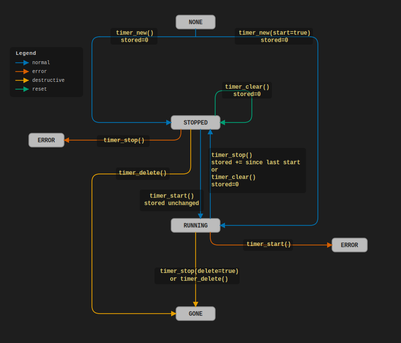

# Timer Builtins User API <!-- omit in toc -->

Author: _Adrian Hawryluk_ (a.k.a. [Ma-XX-oN](https://github.com/Ma-XX-oN))

- [What These Timers Measure](#what-these-timers-measure)
- [Quick Start](#quick-start)
- [Signatures](#signatures)
  - [Return Behavior](#return-behavior)
  - [`timer_run` Named Args After `args...`](#timer_run-named-args-after-args)
- [Timer Lifecycle](#timer-lifecycle)
- [Manual Timer Control](#manual-timer-control)
- [Output Format](#output-format)
- [Format Tokens](#format-tokens)
- [When to Use Which](#when-to-use-which)
- [Common Patterns](#common-patterns)
- [Common Mistakes](#common-mistakes)

## What These Timers Measure

The `timer_*` builtins measure **expression evaluation time only**.  They do
_not_ profile script parsing, module instantiation, geometry operations, or
rendering.  Use them to benchmark the cost of OpenSCAD expressions and
function calls — not the overall render pipeline.

**Module body execution order** is a critical subtlety.  Inside any module
body (including the top-level file scope), OpenSCAD processes all assignments
in a first pass and all module instantiations in a second pass.  A bare `for`
statement is a module instantiation — it runs _after_ all assignments in the
same scope.  Timer calls are assignments, so both `timer_start` and
`timer_stop` fire before any `for` loop body in the same scope ever executes.
See [Common Mistakes](#common-mistakes) for the broken pattern and the
correct recursive alternative.

## Quick Start

The simplest way to time something is `timer_run`:

```openscad
result = timer_run("my_fn", function() expensive_computation());
// ECHO: timer my_fn 0:00.123
```

Pass arguments to the function:

```openscad
result = timer_run("dot", function(a, b) a * b, [1,2,3], [4,5,6]);
// ECHO: timer dot 0:00.001
```

For benchmarking, get average microseconds directly:

```openscad
function _loop(fn, i, n) = i >= n ? undef : let(_ = fn(i)) _loop(fn, i+1, n);

avg_us = timer_run("sum1000",
                   function() _loop(function(i) sum(big_list), 0, 1000),
                   fmt_str=undef, iterations=1000);
// avg_us is a number
```

## Signatures

```text
timer_new(name="", type="monotonic", start=false) -> number
timer_start(timer_id) -> undef
timer_stop(timer_id, fmt_str="timer {n} {mmm}:{ss}.{dddddd}", iterations=1, output=false, delete=false) -> number | string
timer_elapsed(timer_id, fmt_str="timer {n} {mmm}:{ss}.{dddddd}", iterations=1, output=false) -> number | string
timer_clear(timer_id) -> undef
timer_delete(timer_id) -> undef
timer_run(name, fn, args..., fmt_str="timer {n} {mmm}:{ss}.{dddddd}", iterations=1) -> any
```

- `timer_id` is the number returned by `timer_new()`.
- `fmt_str` controls the format of the returned/echoed string; pass `undef`
  to get a raw microsecond number instead.
- `iterations` divides the elapsed time, for averaging across a loop.
- `output=true` makes `timer_stop`/`timer_elapsed` echo in addition to
  returning.
- `type` may be `"monotonic"` (wall-clock, default) or `"CPU"`
  (case-insensitive).

### Return Behavior

| Call form                                | Return type             | Echo behavior           |
| ---------------------------------------- | ----------------------- | ----------------------- |
| `timer_stop/elapsed(..., fmt_str=undef)` | `number` (microseconds) | only when `output=true` |
| `timer_stop/elapsed(..., fmt_str="...")` | `string`                | only when `output=true` |
| `timer_run(...)`                         | result of `fn(...)`     | always echoes timing    |

### `timer_run` Named Args After `args...`

`timer_run` has a variadic `args...` block. Parameters after that block must be
passed by name.

```openscad
// valid
timer_run("ok", function(a, b) a + b, 1, 2, fmt_str=undef, iterations=10);

// invalid: positional arg after args... block
timer_run("bad", function(a, b) a + b, 1, 2, undef, 10);
```

## Timer Lifecycle



Timers do not persist across renders — all timers are implicitly deleted when a render completes.

`timer_elapsed` is read-only — no state change — and returns:

- when `RUNNING`: stored + live elapsed since last start
- when `STOPPED`: stored elapsed

## Manual Timer Control

When `timer_run` is not flexible enough — e.g. timing a loop body, or
capturing multiple checkpoints — use the manual pattern:

```openscad
t = timer_new("loop");
_ = timer_start(t);
// ... work ...
elapsed = timer_stop(t, undef);   // returns microseconds
echo(elapsed);
```

Accumulate across N iterations and average with `iterations`:

```openscad
function _loop(fn, i, n) = i >= n ? undef : let(_ = fn(i)) _loop(fn, i+1, n);

t = timer_new("sum", start=true);
_ = _loop(function(i) sum(big_list), 0, 1000);
elapsed = timer_stop(t, iterations=1000, output=true, delete=true);
```

> **Notes:**
> 
> - `timer_stop` adds elapsed since the last `timer_start` to the
> stored value and pauses.  `timer_start` resumes accumulating from that
> stored value — it does **not** reset to zero.  Use `timer_clear` to reset
> elapsed to zero without starting.
> - A bare `for` loop shouldn't be sandwiched between timer calls in the same
>   module scope.  It doesn't do what you think it does. See [Common Mistakes](#common-mistakes).
> - Calling `timer_start` is an error if the timer is already running.
> - Calling `timer_stop` is an error if the timer is not running.
> - Calling `timer_elapsed` is valid in either state.
> - See [Timer Lifecycle](#timer-lifecycle) for a full view of the lifecycle.

## Output Format

By default, `timer_stop`, `timer_elapsed`, and `timer_run` format elapsed time
as:

```text
timer <name> 0:00.000
```

Pass `undef` as `fmt_str` to get raw microseconds as a number:

```openscad
us = timer_stop(t, undef);         // returns e.g. 123456
```

Pass a custom format string to control the output:

```openscad
s = timer_stop(t, "{sss}.{dddddd} s");  // e.g. "0.123456 s"
```

## Format Tokens

| Token    | Meaning                                                                             |
| -------- | ----------------------------------------------------------------------------------- |
| `{n}`    | timer name                                                                          |
| `{f}`    | elapsed microseconds (numeric string)                                               |
| `{i}`    | `iterations` value                                                                  |
| `{h}`    | hours (1+ digits)                                                                   |
| `{hh}`   | hours, 2-digit zero-padded (no rollover)                                            |
| `{m}`    | minute within hour (0–59)                                                           |
| `{mm}`   | minute within hour, 2-digit zero-padded                                             |
| `{mmm}`  | total minutes (no 60 rollover)                                                      |
| `{s}`    | second within minute (0–59)                                                         |
| `{ss}`   | second within minute, 2-digit zero-padded                                           |
| `{sss}`  | total seconds (no 60 rollover)                                                      |
| `{d...}` | fractional seconds — number of `d`s sets decimal places (up to 6 meaningful digits) |

Use `{{` and `}}` for literal braces.

Examples:

| `fmt_str`                                   | Example output          |
| ------------------------------------------- | ----------------------- |
| `"timer {n} {mmm}:{ss}.{dddddd}"` (default) | `timer foo 0:00.123456` |
| `"{sss}.{dddddd} s"`                        | `0.123456 s`            |
| `"{f} μs"`                                  | `123456 μs`             |
| `"{h}h {mm}m {ss}s"`                        | `0h 00m 00s`            |

## When to Use Which

| Situation                          | Recommended                                           |
| ---------------------------------- | ----------------------------------------------------- |
| Time a single function call        | `timer_run`                                           |
| Time an expression inline          | `timer_new` + `timer_start` + `timer_stop`            |
| Average over many iterations       | `timer_stop(..., iterations=N)`                       |
| Multiple checkpoints in sequence   | Manual timers, one per checkpoint                     |
| Benchmark repeated calls in a loop | Recursive helper + manual timer (see Common Patterns) |

## Common Patterns

**Average cost per call over N iterations:**

A bare `for` loop cannot interleave with timer calls (see Common Mistakes).
Use a recursive helper instead:

```openscad
function _loop(fn, i, n) = i >= n ? undef : let(_ = fn(i)) _loop(fn, i+1, n);

avg_us = timer_run("avg", function() _loop(function(i) my_fn(i), 0, 1000),
                   fmt_str=undef, iterations=1000);
echo(avg_us);
```

**Time two alternatives and compare:**

```openscad
t1 = timer_new("method_a");
_ = timer_start(t1);
a = method_a(data);
s1 = timer_stop(t1, undef);

t2 = timer_new("method_b");
_ = timer_start(t2);
b = method_b(data);
s2 = timer_stop(t2, undef);

echo(str("a=", s1, " μs  b=", s2, " μs  ratio=", s1/s2));
```

**Quick one-liner with `timer_run`:**

```openscad
v = timer_run("build", function() build_complex_list(n=1000));
echo(v);
```

## Common Mistakes

- **Stopping a timer that is not running** — `timer_stop` on a stopped timer
  is a hard error.  Use `timer_elapsed` if you just want to read the value.
- **Starting a timer that is already running** — `timer_start` on a running
  timer is a hard error.  Call `timer_stop` or `timer_clear` first.
- **Expecting `timer_clear` and `timer_stop` to behave the same** —
  `timer_clear` resets elapsed to zero (and stops).  `timer_stop` adds elapsed
  since the last start to the stored value (and stops) — elapsed is preserved,
  not zeroed.  Use `timer_clear` when you want a clean reset.
- **Expecting render times** — these timers only cover expression evaluation.
  Module rendering and CSG operations happen in a separate pipeline phase and
  are not captured.
- **Forgetting `output=true`** — `timer_stop` and `timer_elapsed` return the
  value but do _not_ echo unless `output=true`.  `timer_run` always echoes.
- **Timing a `for` loop with sandwiched timer calls** — In any scope (module
  body or file scope), OpenSCAD evaluates all assignments first, then all
  module instantiations.  A bare `for` statement is a module instantiation.
  The following looks correct but measures nothing:

  ```openscad
  t = timer_new("sum", start=true);    //  assignment — runs in phase 1
  for (i = [0:999]) { x = sum(lst); }  // module inst — runs in phase 2
  _ = timer_stop(t, output=true);      //  assignment — runs in phase 1 (!)
  ```

  Both timer calls fire before the loop body executes.  Use a recursive
  function instead, which stays entirely in expression context:

  ```openscad
  function _loop(fn, i, n) = i >= n ? undef : let(_ = fn(i)) _loop(fn, i+1, n);

  avg_us = timer_run("sum", function() _loop(function(i) sum(lst), 0, 1000),
                     fmt_str=undef, iterations=1000);
  ```
