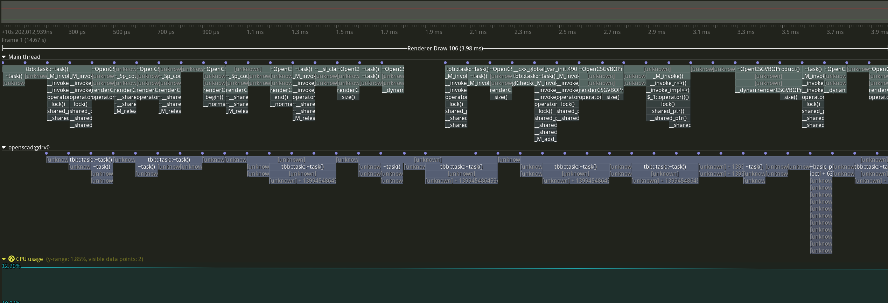

# Profiling with tracy

To enable [tracy](https://github.com/wolfpld/tracy) support, build with `-DTRACY_ENABLE=ON`.
By default the build type is set to `RelWithDebInfo` when tracy support is enabled.
Note that the current client version is 0.10, and the server version must match the client version.
This can be changed in the `CMakeList.txt` by fetching another version.

To capture a trace, you should have tracy installed on your system, which acts as both the server and profiling viewer.
In the GUI, click `connect`, and then run openscad, you should see a small window like this:

Note that if you run openscad in GUI, it will continuously send data to the server until you close the GUI.
You can view the profile data interactively even when the GUI is open.

To view frame statistics, you should select the drop down button at the top of the GUI, and choose `Renderer Draw`.
In the `Info` GUI, you can click on `frame statistics` and look at a histogram of frame time and FPS information.

By clicking on the left/right buttons next to the drop down button, you can focus on the individual frame and perform analysis.

The `Statistics` window allows user to view the sum of execution time of functions.

Right click on the location column in the statistics window allows the user to view the source code and time spent on different part of the code.

