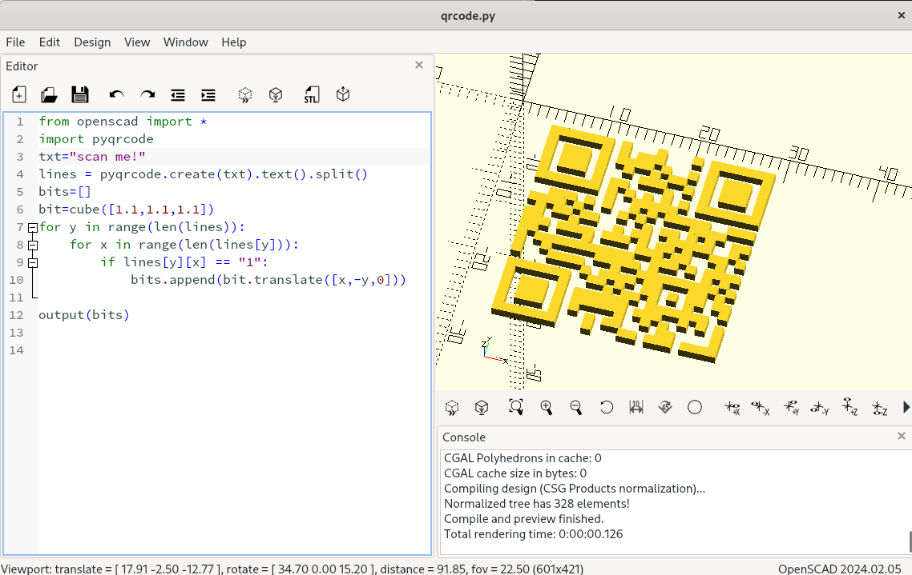
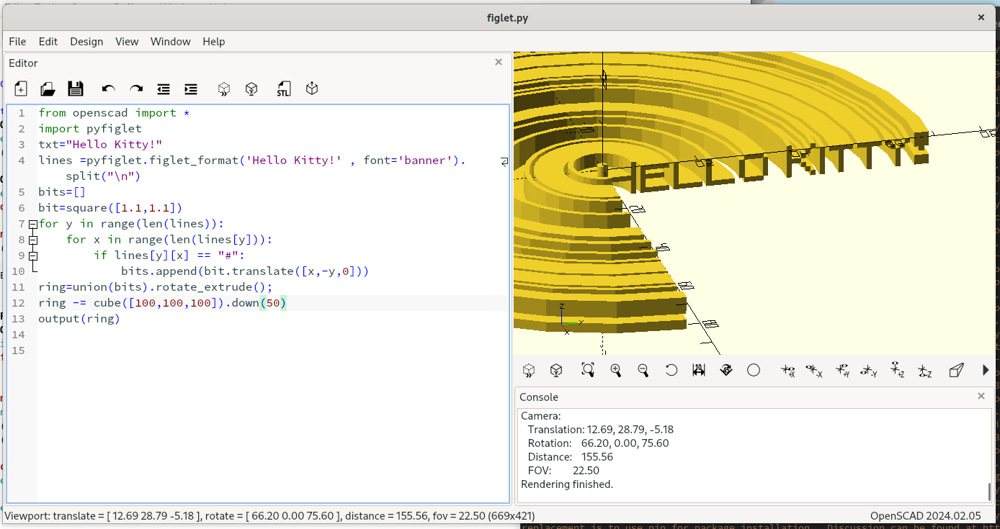
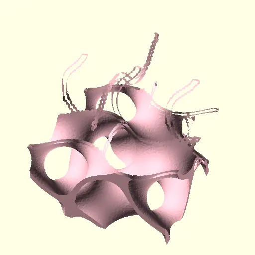
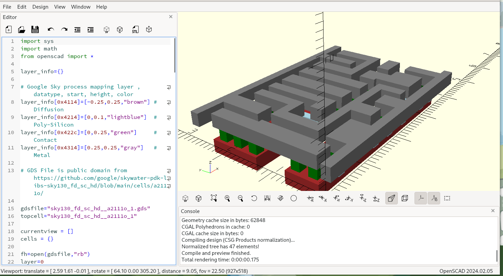
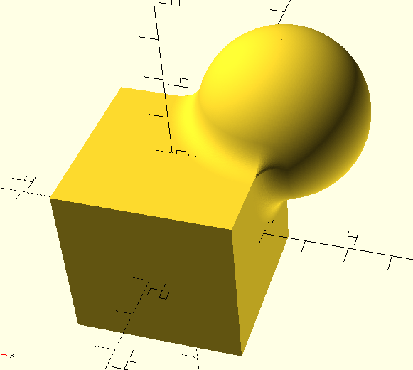
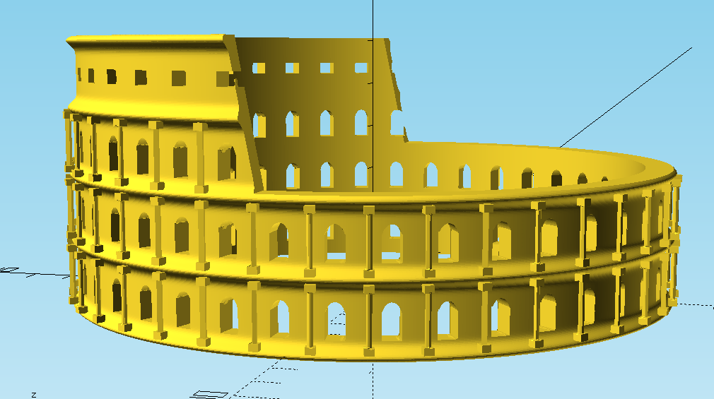
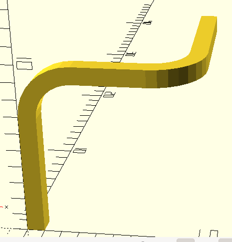
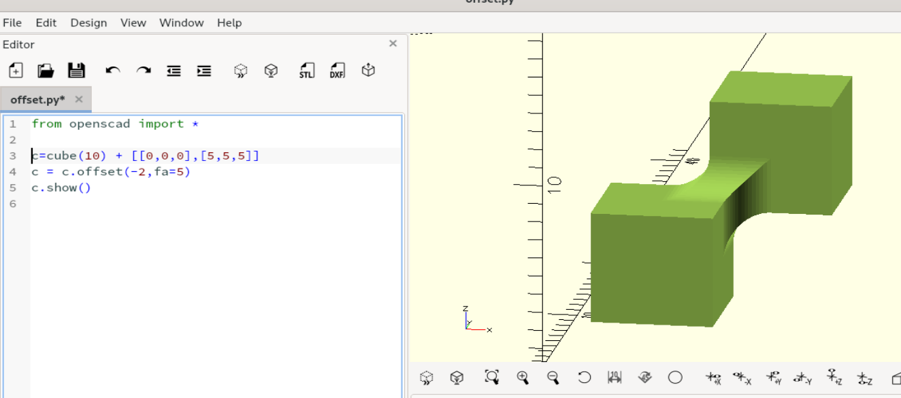
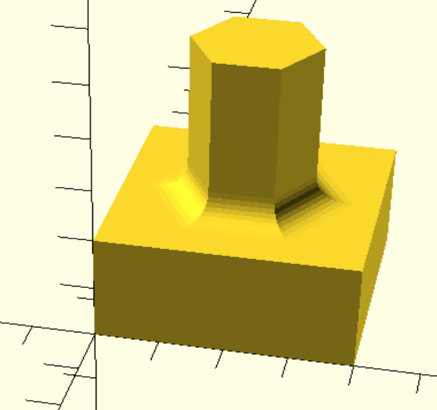

# Usage samples

Lets create a housing for the new camera.

    from openscad import *
    fn=20

    box = cube([40,40,40])
    box -= cube([36,36,40]) + [2,2,2]
    box -= cylinder(d=20,h=5) + [20,20,-1]
    box -= cylinder(d=3,h=10) ^ [[5,35],[5,35], -1]
    box.show()

The examples below depend on external Python Libraries, which you can install with pip.

In case PythonSCAD cannot find it, please tell it the path like

    import sys
    sys.path.append("\\path\\to\\python\\site-packages-dir")

Many applications are possible like

a [QR code generator](examples/qrcode.txt)

or [Using Figlet 3D Ascii art](examples/figlet.txt)

> or [A Gyroid](examples/gyroid.txt)

or even [GDS File Parser](examples/read_gds.txt) used for creating Microchips

PythonSCAD is present on Thingiverse
* [Zelda's Spirit Flute](https://thingiverse.com/thing:6939488) by L.D.
* [Dremel Impeller Blower](https://thingiverse.com/thing:6766806) by jhnphn

### Additional features

On top of Python support, this fork also has the following extra capabilities.

### F-REP/SDF engine (libfive)

Use SDFs to create organic meshes!

    from openscad import *
    from pylibfive import *
    c=lv_coord()
    s1=lv_sphere(lv_trans(c,[2,2,2]),2)
    b1=lv_box(c,[2,2,2])
    sdf=lv_union_smooth(s1,b1,0.6)
    fobj=frep(sdf,[-4,-4,-4],[4,4,4],20)
    output(fobj)

If you're unfamiliar please look up "Inigo Quilez", the god-father of SDFs.

The available operators are:

  * X()
  * Y()
  * Z()
  * operators + = * / %
  * sqrt()
  * abs()
  * max()
  * min()
  * sin()
  * cos()
  * tan()
  * asin()
  * acos()
  * atan()
  * atan2()
  * exp()
  * log()

I've integrated libfive into OpenSCAD, but only through the Python bindings.

See example at [libfive_example.py ](examples/libfive_example.txt) or [collosseum.py ](examples/collosseum.txt)

### ifrep

There is first support for ifrep. ifrep takes an OpenSCAD solid as input and returns a variable which you can use along with your other SDF equations. You can use it for offsetting exising objects.

Objects double as dictionaries

Each of the generated objects has a built-in dictionary, which can be used to store additional information along with the object. e.g to store coordinate information about special locations of the object.

      myobject["top"] = [10,10,90]

### Path extrude

path_extrude works very similar to linear_extrude or rotate_extrude. IMHO it can actually act as a superset of both of them. Like in linear_extrude and rotate_extrude, the extruded 2D shape is always perpendicular to the extrusion. The syntax is:

    square().path_extrude([[0,0,0],[0,0,10]])

Possible parameters are:

  * path - list of points in 3d space where to feed the path. Points can optionally specified as a 4-value-vector where the 4th value acts as a radius parameter for round corners
  * twist - amount of degrees to twist the profile along the path
  * origin - determines 2D center point of the twist rotation within the profile
  * scale - factor to scale the profile along the path, can also be 2d vector
  * closed - whether to close the path to form a ring . true/false
  * xdir - Direction of the x vector of the profile for the very first path segment.

See example at [path_extrude_example.py ](examples/path_extrude_example.txt)

### 3D offset

In this version offset also operates on 3D objects in addition. Fillets can easily be created by downsizing concave edges

    from openscad import *
    c = cube(10) + [[0,0,0], [5,5,5]]
    c = c.offset(-2,fa=5)
    c.show()

### Fileting

Often its nice to have a small fillet in your design. You can e.g. crfeate them while combinig the objects, but there many different variants possible.

    from openscad import *
    plate = cube([40,40,20])
    tower = cylinder(50,10,fn=6) + [20,20,0]
    design= union(plate, tower,fn=10,r=5)
    design.show()
