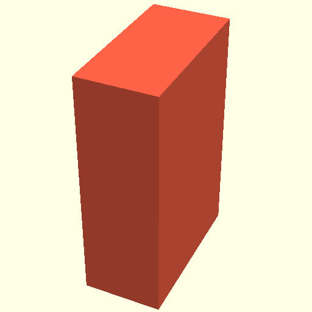

# PythonSCAD

**Design precise 3D models with Python.**

PythonSCAD is a script-based 3D modeling application with a full GUI. Write
parametric, engineering-oriented models in Python, preview them live, and export
to STL, 3MF, and other formats for 3D printing and manufacturing.

<div id="hero-download" class="hero-download">
  <div class="hero-download-fallback">
    <p class="hero-download-actions">
      <a class="md-button md-button--primary hero-download-button"
         href="https://github.com/pythonscad/pythonscad/releases/latest">
        Download latest release
      </a>
      <a class="md-button hero-download-all" href="downloads/">All downloads</a>
    </p>
    <p class="hero-download-file">
      Releases on
      <a href="https://github.com/pythonscad/pythonscad/releases">GitHub</a>
    </p>
  </div>
  <p class="hero-download-loading" hidden aria-live="polite">Loading latest release…</p>
  <noscript>
    <p class="download-noscript-note">
      JavaScript is not required to use this website. If you enable it though,
      this page can detect your operating system and suggest the best download path
      (for example APT on Debian/Ubuntu, YUM on Fedora/RHEL, etc.), show the current release version,
      and link directly to the matching download.
    </p>
  </noscript>
  <div class="hero-download-enhanced" hidden></div>
</div>

[Get started](get_started.md){ .md-button }
[Tutorial](tutorial/getting_started.md){ .md-button .md-button--primary }
[All downloads](downloads.md)


## Is PythonSCAD for you?

### A great fit if you…

- think in code and want precise, repeatable parametric models
- already know Python — or want to **learn Python or programming** through something tangible
- need models for 3D printing, CNC, or engineering workflows
- want the full Python ecosystem: pip packages, your IDE, Jupyter notebooks

### Probably not the right tool if you…

- need organic sculpting, animation, or VFX → [Blender](https://www.blender.org/)
- prefer click-to-design CAD → [FreeCAD](https://www.freecad.org/)

## Why PythonSCAD?

- **Python-native** — write `.py` scripts directly in the app; no external code generator
- **Instant visual feedback** — see your code become a 3D model as you work; export and **3D-print something you wrote**
- **Rewarding for learners** — a few lines of Python can produce a useful physical object, which makes programming feel concrete
- **Live preview** — interactive 3D view, customizer, and export in one desktop app
- **Powerful geometry** — booleans, extrusions, fillets, surfaces, and more
- **Cross-platform** — Windows, Linux, macOS, plus a browser WebAssembly build
- **Open and extensible** — open source; integrate libraries, scripts, and tooling you already use

## From code to model

=== "Python"

    ```python
    from pythonscad import *

    c = cube([10, 20, 30]).color("Tomato")
    show(c)
    ```

=== "OpenSCAD"

    ```python
    from openscad import *

    c = cube([10, 20, 30]).color("Tomato")
    show(c)
    ```



Browse the [Examples gallery](examples.md) for QR codes, gyroids, GDS import, and more.

## Learn more

1. [Download](downloads.md) for your platform — or use the button above
2. [Installation](installation.md) — APT/YUM repos, AppImage, PyPI, and build options
3. [Getting Started tutorial](tutorial/getting_started.md) — hands-on walkthrough
4. [Cheat sheet](cheatsheet.md) and [API reference](reference/primitives3d.md)

## Community

- [r/OpenPythonSCAD](https://www.reddit.com/r/OpenPythonSCAD/)
- [Google Group](https://groups.google.com/g/pythonscad)
- [Community wiki](http://old.reddit.com/r/openpythonscad/wiki/index)
- [Python type stubs for IDE support](https://raw.githubusercontent.com/pythonscad/pythonscad/refs/heads/master/libraries/python/stubs/openscad/__init__.pyi)
- [Contact & support](contact.md)

---

PythonSCAD is open source on [GitHub](https://github.com/pythonscad/pythonscad). It builds on
the solid foundation of [OpenSCAD](https://openscad.org) and stays closely synced with upstream;
Python-specific features are developed here. See [Upstream sync](development/upstream-sync.md).
